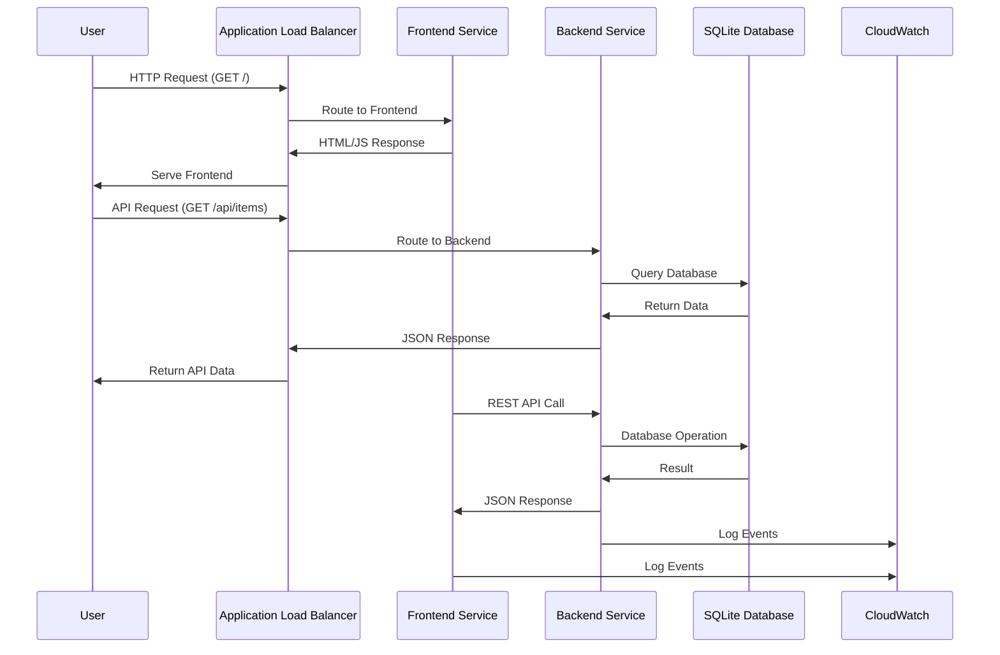
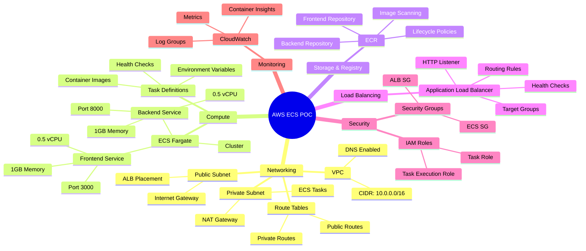
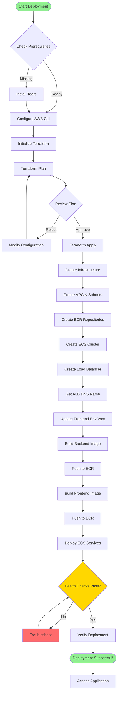
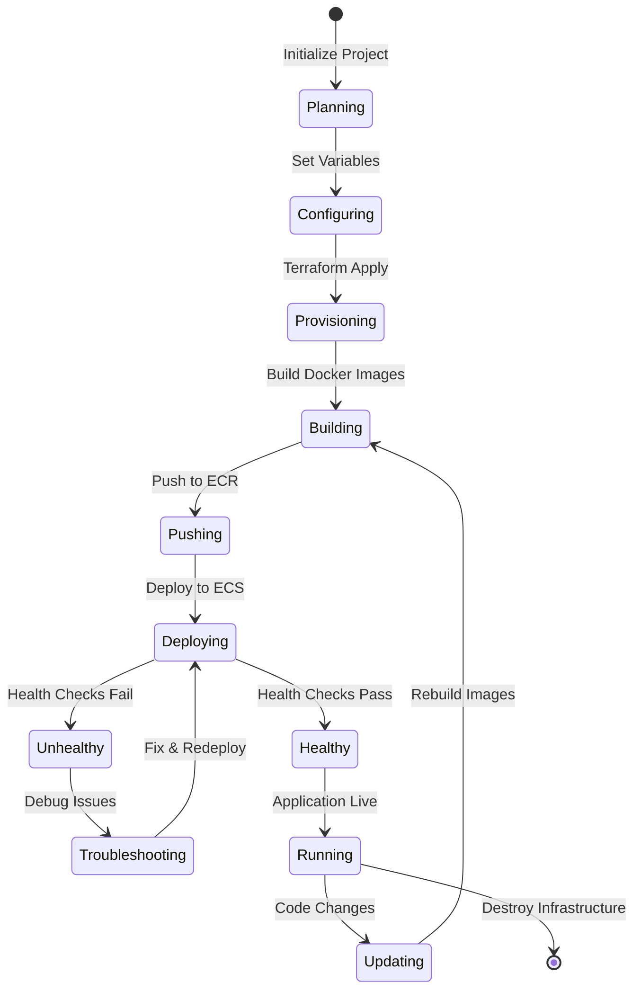
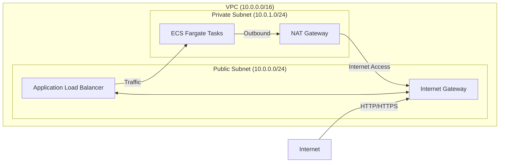
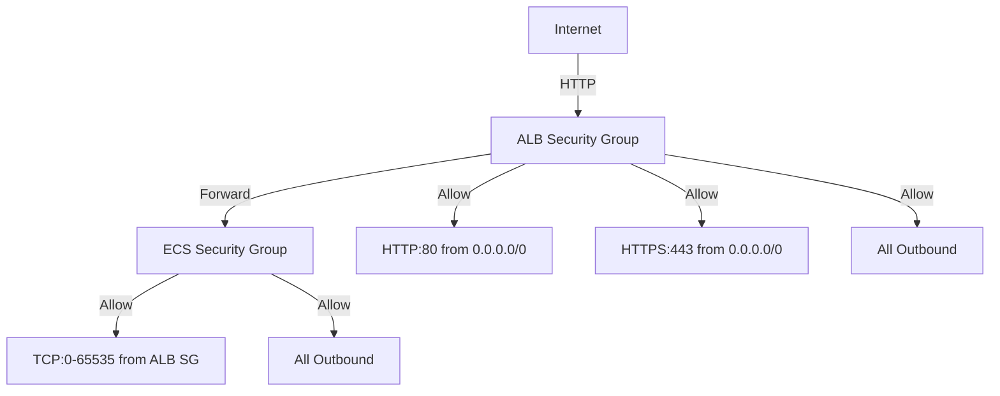
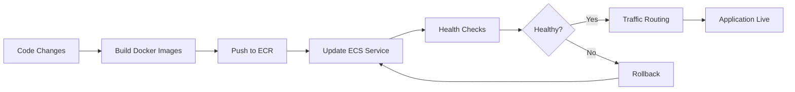
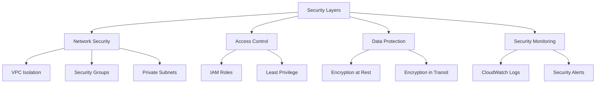
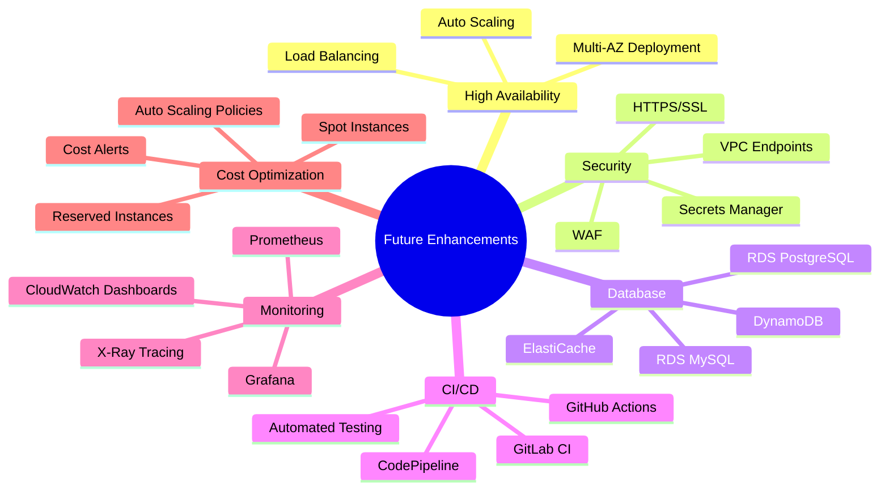

# 🚀 FastAPI + Next.js AWS ECS Deployment POC

<div align="center">


**A comprehensive Proof of Concept demonstrating Infrastructure as Code (IaC) deployment of a modern full-stack application to AWS ECS Fargate using Terraform**

[](https://github.com/NoManNayeem/Terraform_POC)
[](LICENSE)

</div>

---

## 📋 Table of Contents

- [Overview](#-overview)
- [Architecture](#-architecture)
- [System Architecture Diagram](#-system-architecture-diagram)
- [Deployment Flow](#-deployment-flow)
- [Project Structure](#-project-structure)
- [Technology Stack](#-technology-stack)
- [Prerequisites](#-prerequisites)
- [Quick Start Guide](#-quick-start-guide)
- [Local Development](#-local-development)
- [AWS Infrastructure Details](#-aws-infrastructure-details)
- [Deployment Workflow](#-deployment-workflow)
- [Monitoring & Logging](#-monitoring--logging)
- [Cost Analysis](#-cost-analysis)
- [Troubleshooting](#-troubleshooting)
- [Security Considerations](#-security-considerations)
- [Best Practices](#-best-practices)
- [Future Enhancements](#-future-enhancements)
- [Contributing](#-contributing)
- [License](#-license)

---

## 🎯 Overview

This project is a **Proof of Concept (POC)** that demonstrates a complete, production-ready infrastructure setup for deploying a modern full-stack application to AWS. It showcases:

- **Infrastructure as Code (IaC)** using Terraform
- **Containerized applications** with Docker
- **Serverless container orchestration** with AWS ECS Fargate
- **Modern web stack**: FastAPI (Python) backend + Next.js (React) frontend
- **Best practices** for cloud infrastructure deployment

### Key Features

✅ **Complete Infrastructure Automation** - All AWS resources defined in Terraform  
✅ **Containerized Applications** - Docker-based deployment  
✅ **Load Balancing** - Application Load Balancer for traffic distribution  
✅ **Network Isolation** - VPC with public/private subnets  
✅ **Monitoring** - CloudWatch integration for logs and metrics  
✅ **Security** - Security groups, IAM roles with least privilege  
✅ **Cost Optimized** - Minimal setup for POC (~$30-50/month)  
✅ **Scalable Architecture** - Ready for production enhancements  

---

## 🏗️ Architecture

### High-Level Architecture

```mermaid
graph TB
    subgraph "Internet"
        User[👤 Users]
    end
    
    subgraph "AWS Cloud"
        subgraph "Public Subnet"
            ALB[Application Load Balancer<br/>Port 80]
        end
        
        subgraph "Private Subnet"
            subgraph "ECS Fargate Cluster"
                FE[Frontend Service<br/>Next.js<br/>Port 3000]
                BE[Backend Service<br/>FastAPI<br/>Port 8000]
            end
        end
        
        subgraph "Storage & Registry"
            ECR[ECR Repositories<br/>Docker Images]
            CW[CloudWatch Logs]
        end
        
        subgraph "Networking"
            VPC[VPC 10.0.0.0/16]
            IGW[Internet Gateway]
            NAT[NAT Gateway]
        end
    end
    
    User -->|HTTP Requests| ALB
    ALB -->|/api/*| BE
    ALB -->|/*| FE
    FE -->|REST API Calls| BE
    BE -->|SQLite DB| BE
    ECS Fargate Cluster -->|Pull Images| ECR
    FE -->|Logs| CW
    BE -->|Logs| CW
    ALB -.->|Public Access| IGW
    ECS Fargate Cluster -.->|Internet Access| NAT
    NAT -.->|Internet| IGW
```

### Component Interaction Flow



---

## 🗺️ System Architecture Diagram

### Detailed Infrastructure Components



---

## 📊 Deployment Flow

### Complete Deployment Process



### Deployment States



---

## 📁 Project Structure

```
Terraform_POC/
│
├── 📂 backend/                          # FastAPI Backend Application
│   ├── 📂 app/
│   │   ├── 📂 api/
│   │   │   ├── __init__.py
│   │   │   └── routes.py               # API endpoints
│   │   ├── 📂 core/
│   │   │   ├── __init__.py
│   │   │   └── config.py               # Configuration management
│   │   ├── 📂 models/
│   │   │   ├── __init__.py
│   │   │   └── database.py             # Database setup
│   │   ├── __init__.py
│   │   └── main.py                     # FastAPI app entry point
│   ├── Dockerfile                      # Backend container definition
│   ├── requirements.txt                # Python dependencies
│   ├── .env.example                    # Environment variables template
│   └── .dockerignore
│
├── 📂 frontend/                        # Next.js Frontend Application
│   ├── 📂 src/
│   │   ├── 📂 app/
│   │   │   ├── layout.tsx              # Root layout
│   │   │   ├── page.tsx                # Home page
│   │   │   └── globals.css             # Global styles
│   │   └── 📂 lib/
│   │       └── api.ts                  # API client
│   ├── Dockerfile                      # Frontend container definition
│   ├── package.json                    # Node.js dependencies
│   ├── next.config.js                  # Next.js configuration
│   ├── tsconfig.json                   # TypeScript configuration
│   ├── .env.example                    # Environment variables template
│   ├── .dockerignore
│   └── .gitignore
│
├── 📂 terraform/                       # Infrastructure as Code
│   ├── main.tf                         # Provider & locals
│   ├── variables.tf                    # Input variables
│   ├── outputs.tf                      # Output values
│   ├── terraform.tfvars                # Variable values (gitignored)
│   ├── terraform.tfvars.example        # Example variables
│   ├── vpc.tf                          # VPC & networking
│   ├── ecr.tf                          # Container registry
│   ├── ecs.tf                          # ECS cluster & services
│   ├── alb.tf                          # Load balancer
│   ├── security-groups.tf             # Security rules
│   ├── iam.tf                          # IAM roles & policies
│   ├── cloudwatch.tf                   # Logging
│   └── README.md                       # Terraform documentation
│
├── 📂 scripts/                         # Deployment Scripts
│   ├── build-and-push.sh              # Build & push Docker images
│   └── deploy.sh                       # Terraform deployment
│
├── docker-compose.yml                  # Local development setup
├── .gitignore                          # Git ignore rules
└── README.md                           # This file
```

---

## 🛠️ Technology Stack

### Backend
- **FastAPI** - Modern Python web framework
- **Python 3.11** - Programming language
- **SQLite3** - Lightweight database (POC)
- **Uvicorn** - ASGI server
- **Pydantic** - Data validation
- **python-dotenv** - Environment variable management

### Frontend
- **Next.js 14** - React framework with SSR
- **TypeScript** - Type-safe JavaScript
- **React 18** - UI library
- **Standalone Mode** - Optimized Docker builds

### Infrastructure
- **Terraform** - Infrastructure as Code
- **AWS ECS Fargate** - Serverless container orchestration
- **AWS ECR** - Container registry
- **AWS VPC** - Virtual private cloud
- **AWS ALB** - Application Load Balancer
- **AWS CloudWatch** - Monitoring & logging
- **Docker** - Containerization

---

## 📋 Prerequisites

### Required Software

| Tool | Version | Purpose | Installation |
|------|---------|---------|--------------|
| **AWS CLI** | Latest | AWS service management | [Install Guide](https://docs.aws.amazon.com/cli/latest/userguide/getting-started-install.html) |
| **Terraform** | >= 1.0 | Infrastructure provisioning | [Install Guide](https://developer.hashicorp.com/terraform/downloads) |
| **Docker** | Latest | Container builds | [Install Guide](https://docs.docker.com/get-docker/) |
| **Node.js** | >= 18 | Frontend development | [Install Guide](https://nodejs.org/) |
| **Python** | >= 3.11 | Backend development | [Install Guide](https://www.python.org/downloads/) |
| **Git** | Latest | Version control | [Install Guide](https://git-scm.com/downloads) |

### AWS Account Setup

1. **Create AWS Account** (if you don't have one)
   - Sign up at [aws.amazon.com](https://aws.amazon.com)

2. **Configure AWS CLI**
   ```bash
   aws configure
   # Enter your Access Key ID
   # Enter your Secret Access Key
   # Enter default region (e.g., us-east-1)
   # Enter default output format (json)
   ```

3. **Required IAM Permissions**
   Your AWS user/role needs permissions for:
   - VPC (create, modify, delete)
   - ECS (full access)
   - ECR (full access)
   - ALB (full access)
   - IAM (create roles)
   - CloudWatch (create log groups)
   - EC2 (for networking components)

   **Quick Setup**: Use `AdministratorAccess` policy for POC (not recommended for production)

---

## 🚀 Quick Start Guide

### Step 1: Clone the Repository

```bash
git clone https://github.com/NoManNayeem/Terraform_POC.git
cd Terraform_POC
```

### Step 2: Configure Environment Variables

#### Backend Configuration

```bash
cd backend
cp .env.example .env
# Edit .env with your values
```

#### Frontend Configuration

```bash
cd frontend
cp .env.example .env.local
# Edit .env.local with your values
```

### Step 3: Configure Terraform

```bash
cd terraform
cp terraform.tfvars.example terraform.tfvars
```

Edit `terraform.tfvars`:

```hcl
aws_region   = "us-east-1"  # Change to your preferred region
project_name = "fastapi-nextjs-poc"
environment  = "dev"

backend_env_vars = {
  DATABASE_URL = "sqlite:///./app.db"
  SECRET_KEY   = "your-secret-key-here"
  DEBUG        = "false"
}

frontend_env_vars = {
  NEXT_PUBLIC_API_URL = "http://your-alb-dns-name/api"
  # Note: Update this after ALB is created
}
```

### Step 4: Deploy Infrastructure

```bash
cd terraform

# Initialize Terraform
terraform init

# Review what will be created
terraform plan

# Apply configuration (creates all AWS resources)
terraform apply
```

**Expected Output:**
```
Apply complete! Resources: 25 added, 0 changed, 0 destroyed.

Outputs:
alb_dns_name = "fastapi-nextjs-poc-alb-1234567890.us-east-1.elb.amazonaws.com"
backend_ecr_repository_url = "123456789012.dkr.ecr.us-east-1.amazonaws.com/fastapi-nextjs-poc-backend"
frontend_ecr_repository_url = "123456789012.dkr.ecr.us-east-1.amazonaws.com/fastapi-nextjs-poc-frontend"
```

### Step 5: Update Frontend Environment Variable

After getting the ALB DNS name, update `terraform.tfvars`:

```hcl
frontend_env_vars = {
  NEXT_PUBLIC_API_URL = "http://fastapi-nextjs-poc-alb-1234567890.us-east-1.elb.amazonaws.com/api"
}
```

Then reapply:

```bash
terraform apply
```

### Step 6: Build and Push Docker Images

```bash
# From project root
./scripts/build-and-push.sh all
```

This will:
1. Authenticate Docker to ECR
2. Build backend image
3. Push backend to ECR
4. Build frontend image
5. Push frontend to ECR

### Step 7: Access Your Application

```bash
cd terraform
terraform output alb_dns_name
```

Access URLs:
- **Frontend**: `http://<alb-dns-name>/`
- **Backend API**: `http://<alb-dns-name>/api/`
- **API Documentation**: `http://<alb-dns-name>/docs`
- **Health Check**: `http://<alb-dns-name>/health`

---

## 💻 Local Development

### Backend Development

```bash
cd backend

# Create virtual environment
python -m venv venv
source venv/bin/activate  # On Windows: venv\Scripts\activate

# Install dependencies
pip install -r requirements.txt

# Copy environment file
cp .env.example .env
# Edit .env with your values

# Run development server
uvicorn app.main:app --reload --host 0.0.0.0 --port 8000
```

Backend available at: `http://localhost:8000`
- API Docs: `http://localhost:8000/docs`
- Health Check: `http://localhost:8000/health`

### Frontend Development

```bash
cd frontend

# Install dependencies
npm install

# Create environment file
cp .env.example .env.local
# Edit .env.local:
# NEXT_PUBLIC_API_URL=http://localhost:8000/api

# Run development server
npm run dev
```

Frontend available at: `http://localhost:3000`

### Docker Compose (Local)

```bash
# From project root
docker-compose up -d

# View logs
docker-compose logs -f

# Stop services
docker-compose down
```

---

## ☁️ AWS Infrastructure Details

### Network Architecture



### Resource Specifications

#### VPC Configuration
- **CIDR Block**: `10.0.0.0/16`
- **Public Subnet**: `10.0.0.0/24` (ALB placement)
- **Private Subnet**: `10.0.1.0/24` (ECS tasks)
- **Availability Zone**: Single AZ (cost optimization)

#### ECS Services

| Service | CPU | Memory | Port | Health Check |
|---------|-----|--------|------|--------------|
| Backend | 0.5 vCPU (512) | 1 GB | 8000 | `/health` |
| Frontend | 0.5 vCPU (512) | 1 GB | 3000 | `/` |

#### Load Balancer
- **Type**: Application Load Balancer (Layer 7)
- **Protocol**: HTTP (port 80)
- **Routing Rules**:
  - `/api/*` → Backend target group
  - `/*` → Frontend target group

### Security Groups



### IAM Roles

1. **ECS Task Execution Role**
   - Pull images from ECR
   - Write logs to CloudWatch
   - Managed policy: `AmazonECSTaskExecutionRolePolicy`

2. **ECS Task Role**
   - Application-level permissions
   - Currently minimal (can be extended)

---

## 🔄 Deployment Workflow

### Complete Deployment Pipeline



### Manual Deployment Steps

1. **Make Code Changes**
   ```bash
   # Edit backend or frontend code
   ```

2. **Build and Push Images**
   ```bash
   ./scripts/build-and-push.sh all
   ```

3. **Force ECS Service Update**
   ```bash
   aws ecs update-service \
     --cluster fastapi-nextjs-poc-cluster \
     --service fastapi-nextjs-poc-backend-service \
     --force-new-deployment
   ```

### Automated Deployment (Future)

For production, consider:
- GitHub Actions CI/CD
- Automated testing
- Blue/Green deployments
- Canary releases

---

## 📊 Monitoring & Logging

### CloudWatch Integration

```mermaid
graph TD
    ECS[ECS Services] -->|Logs| CW[CloudWatch Logs]
    ECS -->|Metrics| Metrics[CloudWatch Metrics]
    
    CW --> LogGroups[Log Groups]
    LogGroups --> BackendLogs[/ecs/fastapi-nextjs-poc/backend]
    LogGroups --> FrontendLogs[/ecs/fastapi-nextjs-poc/frontend]
    
    Metrics --> ContainerInsights[Container Insights]
    ContainerInsights --> CPU[CPU Utilization]
    ContainerInsights --> Memory[Memory Utilization]
    ContainerInsights --> Network[Network Metrics]
```

### Viewing Logs

```bash
# Backend logs
aws logs tail /ecs/fastapi-nextjs-poc/backend --follow

# Frontend logs
aws logs tail /ecs/fastapi-nextjs-poc/frontend --follow

# Filter logs
aws logs filter-log-events \
  --log-group-name /ecs/fastapi-nextjs-poc/backend \
  --filter-pattern "ERROR"
```

### Key Metrics to Monitor

- **CPU Utilization** - Should stay below 80%
- **Memory Utilization** - Should stay below 80%
- **Request Count** - Track API calls
- **Error Rate** - Monitor 4xx/5xx responses
- **Response Time** - API latency
- **Task Count** - Running vs desired tasks

---

## 💰 Cost Analysis

### Monthly Cost Breakdown (POC)

| Service | Configuration | Estimated Cost |
|---------|--------------|----------------|
| **NAT Gateway** | Single AZ | ~$32/month |
| **Application Load Balancer** | 1 ALB | ~$16/month |
| **ECS Fargate** | 2 tasks (0.5 vCPU, 1GB each) | ~$15/month |
| **ECR** | Storage (minimal) | ~$0.10/month |
| **CloudWatch** | Logs & Metrics | ~$2/month |
| **Data Transfer** | Minimal | ~$1/month |
| **Total** | | **~$66/month** |

### Cost Optimization Tips

1. **Use Single AZ** (already implemented)
2. **Minimal Task Sizes** (already implemented)
3. **Stop Services When Not in Use**
   ```bash
   # Scale down to 0
   aws ecs update-service \
     --cluster fastapi-nextjs-poc-cluster \
     --service fastapi-nextjs-poc-backend-service \
     --desired-count 0
   ```
4. **Use Reserved Capacity** (for production)
5. **Monitor and Optimize** resource usage

### Cost Alerts

Set up AWS Budgets to monitor spending:
```bash
aws budgets create-budget \
  --account-id YOUR_ACCOUNT_ID \
  --budget file://budget.json
```

---

## 🔧 Troubleshooting

### Common Issues and Solutions

#### 1. ECS Tasks Not Starting

**Symptoms**: Tasks stuck in PENDING or STOPPED state

**Diagnosis**:
```bash
# Check service events
aws ecs describe-services \
  --cluster fastapi-nextjs-poc-cluster \
  --services fastapi-nextjs-poc-backend-service

# Check task details
aws ecs describe-tasks \
  --cluster fastapi-nextjs-poc-cluster \
  --tasks TASK_ID
```

**Common Causes**:
- Image not found in ECR → Push images
- Insufficient permissions → Check IAM roles
- Health check failures → Check application logs
- Resource constraints → Increase CPU/memory

#### 2. Health Check Failures

**Symptoms**: Tasks constantly restarting

**Solutions**:
```bash
# Check application logs
aws logs tail /ecs/fastapi-nextjs-poc/backend --follow

# Verify health endpoint
curl http://<alb-dns>/health

# Adjust health check settings in terraform/ecs.tf
```

#### 3. Cannot Access Application

**Symptoms**: 502 Bad Gateway or connection timeout

**Checklist**:
- [ ] ALB security group allows HTTP from internet
- [ ] ECS security group allows traffic from ALB
- [ ] Target groups are healthy
- [ ] Tasks are running
- [ ] Application is listening on correct port

#### 4. Images Not Found

**Symptoms**: Task fails with "CannotPullContainerError"

**Solution**:
```bash
# Verify image exists
aws ecr describe-images \
  --repository-name fastapi-nextjs-poc-backend

# Rebuild and push
./scripts/build-and-push.sh all
```

#### 5. Terraform Apply Fails

**Common Errors**:
- **Insufficient permissions** → Check IAM policies
- **Resource limits** → Check AWS service quotas
- **Invalid configuration** → Run `terraform validate`

---

## 🔒 Security Considerations

### Current Security Measures



### Security Best Practices

1. **Network Security**
   - ✅ ECS tasks in private subnets
   - ✅ Security groups with least privilege
   - ⚠️ Add WAF for production
   - ⚠️ Use HTTPS (ACM certificates)

2. **Access Control**
   - ✅ IAM roles with minimal permissions
   - ⚠️ Use AWS Secrets Manager for sensitive data
   - ⚠️ Enable MFA for AWS accounts
   - ⚠️ Rotate access keys regularly

3. **Data Protection**
   - ⚠️ Enable ECR image scanning
   - ⚠️ Use encrypted EBS volumes
   - ⚠️ Encrypt CloudWatch logs
   - ⚠️ Use RDS with encryption for production

4. **Monitoring**
   - ✅ CloudWatch logging enabled
   - ⚠️ Set up CloudWatch alarms
   - ⚠️ Enable VPC Flow Logs
   - ⚠️ Use AWS GuardDuty

### Production Security Checklist

- [ ] Enable HTTPS with ACM certificates
- [ ] Use AWS Secrets Manager for secrets
- [ ] Enable VPC Flow Logs
- [ ] Set up WAF rules
- [ ] Enable ECR image scanning
- [ ] Use encrypted EBS volumes
- [ ] Implement network ACLs
- [ ] Set up CloudWatch alarms
- [ ] Enable AWS GuardDuty
- [ ] Regular security audits

---

## ✅ Best Practices

### Infrastructure as Code

- ✅ **Modular Structure** - Separate files by resource type
- ✅ **Version Control** - All code in Git
- ✅ **Documentation** - Comprehensive README
- ⚠️ **Remote State** - Use S3 backend for production
- ⚠️ **State Locking** - Use DynamoDB for state locks

### Application Development

- ✅ **Environment Variables** - Use .env files
- ✅ **Health Checks** - Implement proper health endpoints
- ✅ **Error Handling** - Comprehensive error handling
- ✅ **Logging** - Structured logging
- ⚠️ **Testing** - Add unit and integration tests

### Deployment

- ✅ **Containerization** - Docker for consistency
- ✅ **Image Tagging** - Use version tags
- ⚠️ **CI/CD** - Automate deployments
- ⚠️ **Blue/Green** - Zero-downtime deployments
- ⚠️ **Rollback Strategy** - Plan for failures

### Monitoring

- ✅ **CloudWatch Logs** - Centralized logging
- ✅ **Health Checks** - Automated health monitoring
- ⚠️ **Metrics Dashboard** - Visualize metrics
- ⚠️ **Alarms** - Set up alerts
- ⚠️ **Distributed Tracing** - Use X-Ray

---

## 🚀 Future Enhancements

### Infrastructure Improvements



### Planned Features

1. **High Availability**
   - Multi-AZ deployment
   - Auto-scaling groups
   - Database replication

2. **Security**
   - HTTPS with ACM certificates
   - AWS WAF integration
   - Secrets Manager integration
   - VPC endpoints

3. **Database**
   - RDS PostgreSQL/MySQL
   - Connection pooling
   - Database migrations

4. **CI/CD**
   - GitHub Actions workflow
   - Automated testing
   - Blue/Green deployments

5. **Monitoring**
   - CloudWatch dashboards
   - AWS X-Ray tracing
   - Custom metrics

6. **Performance**
   - CloudFront CDN
   - Redis caching
   - Database optimization

---

## 🤝 Contributing

Contributions are welcome! Please follow these steps:

1. **Fork the repository**
2. **Create a feature branch**
   ```bash
   git checkout -b feature/amazing-feature
   ```
3. **Make your changes**
4. **Test thoroughly**
5. **Commit your changes**
   ```bash
   git commit -m "Add amazing feature"
   ```
6. **Push to the branch**
   ```bash
   git push origin feature/amazing-feature
   ```
7. **Open a Pull Request**

### Contribution Guidelines

- Follow existing code style
- Add tests for new features
- Update documentation
- Ensure all tests pass
- Follow semantic versioning

---

## 📝 License

This project is licensed under the MIT License - see the [LICENSE](LICENSE) file for details.

---

## 📞 Support & Contact

- **GitHub Issues**: [Report Issues](https://github.com/NoManNayeem/Terraform_POC/issues)
- **Documentation**: See `terraform/README.md` for detailed Terraform documentation
- **Author**: NoManNayeem

---

## 🙏 Acknowledgments

- [HashiCorp Terraform](https://www.terraform.io/) - Infrastructure as Code
- [AWS ECS](https://aws.amazon.com/ecs/) - Container orchestration
- [FastAPI](https://fastapi.tiangolo.com/) - Modern Python framework
- [Next.js](https://nextjs.org/) - React framework
- [Docker](https://www.docker.com/) - Containerization platform

---

<div align="center">

**⭐ If you find this project helpful, please give it a star! ⭐**

Made with ❤️ for the DevOps community

</div>
